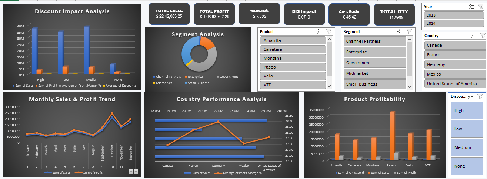

# Sales & Financial Analysis Dashboard

## Project Overview

This project focuses on analyzing company sales, revenue, expenses, and profitability to evaluate overall business performance and operational efficiency. The dashboard was developed using Microsoft Excel with Pivot Tables, Pivot Charts, Power Query, and KPI-based financial analysis.

The objective of this project is to transform raw financial data into actionable business insights that support strategic decision-making.

---

# Business Problem

Businesses often generate high sales revenue but struggle to maintain strong profitability due to operational expenses, discount strategies, and inefficient financial management.

The company required a dashboard to:

- Monitor overall financial performance
- Analyze revenue and profit trends
- Identify high-performing products and regions
- Evaluate operational efficiency
- Understand the impact of discounts on profitability

---

# Project Objectives

- Analyze sales and financial performance
- Track revenue, expenses, and profit trends
- Identify profitable business segments
- Measure operational efficiency using KPIs
- Generate business insights for strategic decisions

---

# Dataset Information

The dataset includes:

- Sales
- Gross Sales
- Profit
- Discounts
- Manufacturing Costs
- Product Segments
- Countries
- Units Sold
- Monthly Performance Data

The dataset was cleaned and transformed before dashboard creation.

---

# Tools & Technologies Used

- Microsoft Excel
- Pivot Tables
- Pivot Charts
- Power Query
- KPI Cards
- Conditional Formatting
- Financial Data Analysis

---

# Key Performance Indicators (KPIs)

The dashboard tracks:

- Total Revenue
- Total Profit
- Profit Margin %
- Total Expenses
- Cost Ratio %
- Units Sold
- Revenue Trends
- Profitability Trends

---

# Dashboard Features

The dashboard includes:

- Revenue trend analysis
- Profit vs Expense comparison
- Country-wise performance analysis
- Product profitability analysis
- Segment performance tracking
- Discount impact analysis
- Interactive slicers and filters
- KPI summary cards

---

# Business Insights

- High revenue does not always result in strong profitability.
- Discounts significantly impact overall profit margins.
- Some business segments generate high revenue but lower profit efficiency.
- Operational expenses consume a substantial portion of total revenue.
- Certain products and regions consistently outperform others in profitability.

---

# Recommendations

- Optimize discount strategies to improve profit margins.
- Focus more on high-profit business segments.
- Improve expense management for better operational efficiency.
- Monitor profitability alongside revenue growth for sustainable performance.

---

# Dashboard Preview

## Main Dashboard



---

# Project Structure

```text
Sales-Financial-Analysis-Dashboard
│
├── Dataset
├── Dashboard
├── Insights
├── Documentation
├── Assets
└── README.md
```

---

# Conclusion

This project demonstrates how financial and sales data can be transformed into actionable business intelligence using Excel-based analytical dashboards. The dashboard helps stakeholders monitor business performance, evaluate profitability, and support data-driven decision-making.
